# Concurrent Webserver ⭐

A multi-threaded HTTP server implementing First in Fist out (FIFO), Shortest File First (SFF) and Shortest File Name First (SFNF) scheduling policies and security on the server. 

The timeline of the project is shown below:

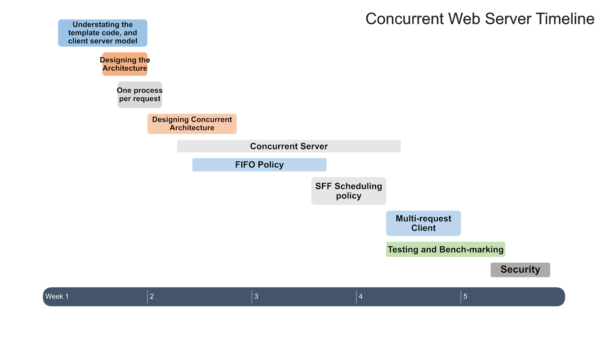

## Directory Structure 📁

```
concurrent_web_servers
├─ Makefile
├─ README.md
├─ circular_queue.c
├─ common_headers.h
├─ common_threads.h
├─ definitions.h
├─ exploit.py
├─ heap.c
├─ helpers.c
├─ io_helper.c
├─ io_helper.h
├─ loadtesting
│  └─ loadtest_webserver.jmx
├─ request.c
├─ request.h
├─ screenshots
│  ├─ Concurrency_Architecture.png
│  ├─ Heap_SFF.png
│  ├─ loadtest_dashboard.png
│  ├─ loadtest_jmeter_threads.png
│  ├─ loadtest_response_time.png
│  ├─ loadtest_throughput.png
│  ├─ Queue_FIFO.png
│  ├─ Scheduler_struct.png
│  ├─ Scheduling_Policy_API.png
│  ├─ producer_consumer_basic.png
│  ├─ schduling_APIs.png
│  └─ time_line.png 
├─ spin.c
├─ test
│  ├─ 1.html
│  ├─ 2.html
│  ├─ 3.html
│  ├─ 4.html
│  ├─ 5.html
│  ├─ 6.html
│  ├─ 7.html
│  └─ 8.html
├─ thread_pool.c
├─ thread_worker.c
├─ wclient.c
└─ wserver.c
```

## Feature Checklist ✅
```
✅ Concurrent Web Server Architecture
✅ First in First out (FIFO) Scheduling Policy
✅ Shortest File First (SFF) Scheduling Policy
✅ Shortest File Name First (SFNF) Scheduling Policy
✅ Multi-Request Client
✅ Load Testing 
✅ Security
```

## Concurrent Architecture 🔥

The basic idealogy behind a concurrent server is the producer-consumer problem where each request from client behaves as a new job which is being produced in the form of a file desciptor. The worker threads are the consumers that pick the job from the data structure (buffer)  implemented according to the scheduling policy. The below image depicts the overall producer-consumer model on the server side - 

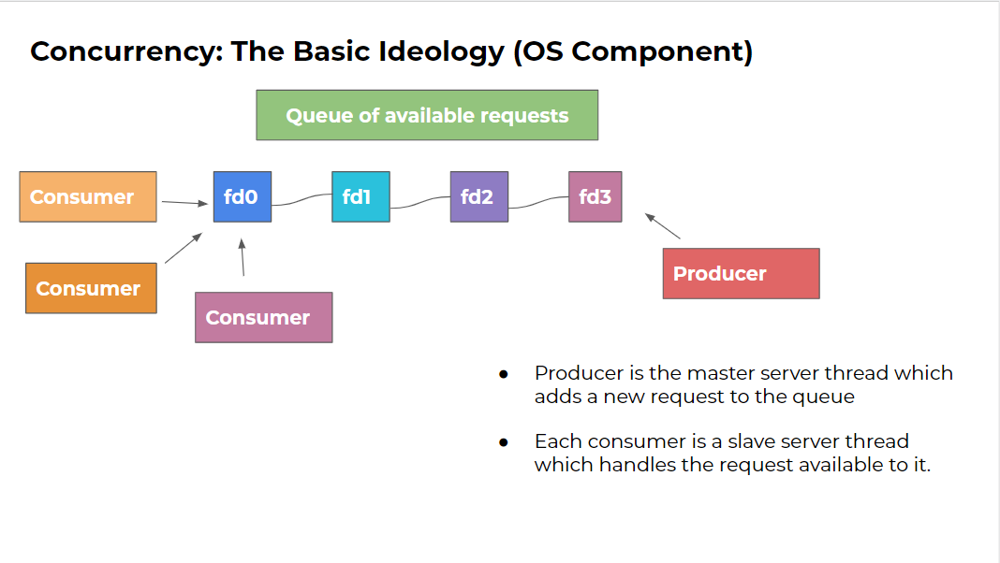

This is further elaborated in these pictures -

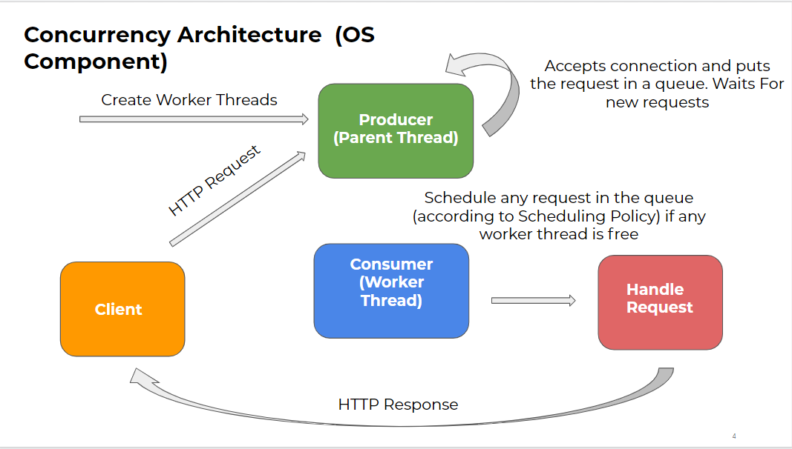

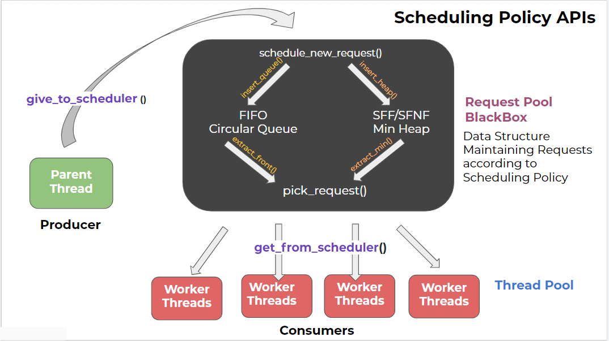

Here, we can see that a client makes an HTTP request to the server (parent thread), this main thread on receive this request puts the request in the buffer data structure and goes immediately to listen for more request, hence the main thread **does not block** other coming requests. Also, at the time of launching the server, it creates worker threads which pick up the request from this buffer data structure where each request is expressed as a file descripter (integer) for that client. These worker threads upon picking up request start serving the requested file or the spin cgi program.
c
## Client 📲 

The client is multi-request that can send a number of requests concurrently to the server by creating a new thread for every request and sending a connection request to the server. Currently the client requests "HTML" and ".cgi" files stored at the server.

## Server 💻

The server is multithreaded that supports different scheduling policies such as FIFO, SFF and SFNF. 

The scheduling policy API implemented in the server is as shown below: 


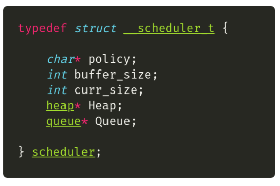

### Base Model 🚲

Base Model has been taken from: [OSTEP Webserver](https://github.com/remzi-arpacidusseau/ostep-projects/tree/master/concurrency-webserver). The base webserver can only server a single client at a given time. It is a **non-concurrent server** and hence **blocks** other requests while it is serving the current one. 

_Note - This base model was provided to us as a starter template for this project._

### FIFO Model 🚁 

When a worker thread wakes, it handles the first request (i.e., the oldest request) in the buffer. Note that the HTTP requests will not necessarily finish in FIFO order; the order in which the requests complete will depend upon how the OS schedules the active threads.


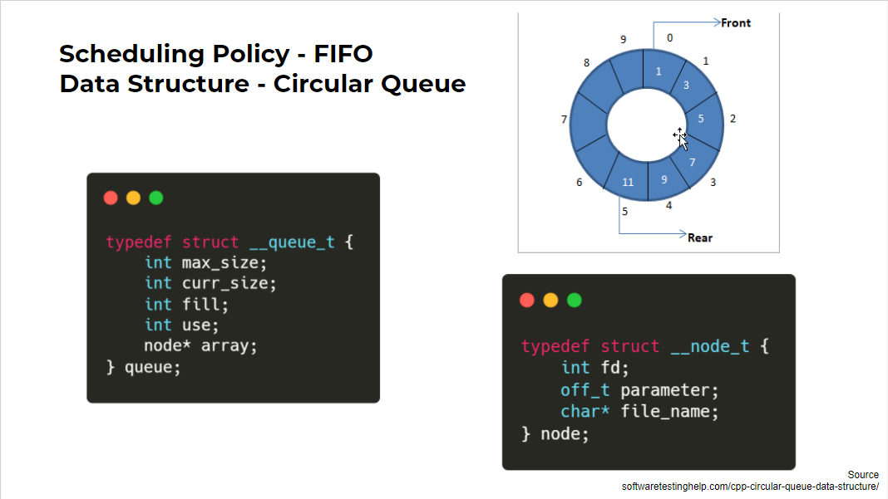

### SFF Model 🚀

When a worker thread wakes, it handles the request for the smallest file. This policy approximates Shortest Job First to the extent that the size of the file is a good prediction of how long it takes to service that request. Requests for static and dynamic content may be intermixed, depending upon the sizes of those files. Note that this algorithm can lead to the starvation of requests for large files. 

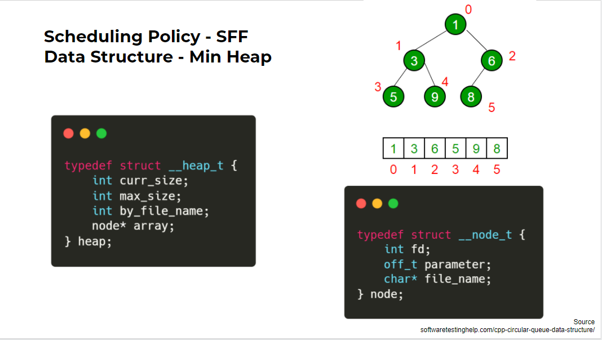

### SFNF Model ✈️

Same as SFF scheduling policy. The only change here is the scheduling parameter. Unlike SFF, SFNF uses shortest file name first. Rest all the API's used by SFNF are the same as that of SFF. 

## Security 🔒
 
The multi-threaded server implementation is safe from any Buffer Overflow or Local file inclusion attacks. 

The implementation given [here](https://github.com/remzi-arpacidusseau/ostep-projects/tree/master/concurrency-webserver/src) is prone to both the attacks. `exploit.py` written in python (requires pwntools) can exploit this bad implementation. Our implementation fixes these issues.   
## Instructions to Run 

Run the `make` command in the base directory to compile all the required files. 

### Running the Webserver ▶️

Use the following command structure to run the server. 

```
prompt> ./wserver [-d basedir] [-p port] [-t threads] [-b Buffer Size] [-s SFF or FIFO or SFNF]
```

The command line arguments to your web server are to be interpreted as follows.

- **basedir**: This is the root directory from which the web server should operate. Default: current working directory (e.g., `.`).

- **port**: The port number that the web server should listen on. Default: 10000.
- **threads**: The number of worker threads that should be created within the webserver. Must be a positive integer.

- **Buffer Size**: The number of request connections that can be accepted at one time. Must be a positive integer. 

- **Scheduling Algo**: The scheduling algorithm to be performed. Must be one of FIFO or SFF or SFNF(Shortest File Name First). Default: FIFO.

For example, you could run your program as:
```
prompt> ./wserver -d . -p 8003 -t 8 -b 16 -s SFF
```

In this case, your web server will listen to port 8003, create 8 worker threads for handling HTTP requests, allocate 16 buffers for connections that are currently in progress (or waiting), and use SFF scheduling for arriving requests.

### Running the client ⏩

* Note that the client is a multi-request client. Therefore, there is provision to send multiple files with the same client. 

Use the following command to run the client: 

```
prompt> ./wclient <host> <port> <filename(s)>
```
The command line arguments to your client are to be interpreted as follows.

- **host**: IP of the server. By default  `localhost/127.0.0.1`
- **port**: The port on which the server is listening. Default: 10000
- **filenames(s)**: Can provide paths to multiple files seperated by spaces. 

For example, you could run your program as:
```
prompt> ./wclient 127.0.0.1 8003 ./test/1.html ./test/2.html 

```
The above command will run a client that will request 2 files concurrently from the server listening on the port 8003. 

## Source Code Overview ✏️
The source code contains the following files: 

- [`wserver.c`](./wserver.c): Contains `main()` for the web server and the basic serving loop. 

- [`request.c`](./request.c):Performs most of the work for handling requests in the web server. All the requests sent to the server are handled in separate threads using `request_handle()` function present in this file.

- [`io_helper.h`](./io_helper.h) and [`io_helper.c`](./io_helper.c): Contains wrapper functions for the system calls invoked by the basic web server and client. The convention is to add `_or_die` to an existing call to provide a version that either succeeds or exits. For example, the `open()` system call is used to open a file, but can fail for a number of reasons. The wrapper, `open_or_die()`, either successfully opens a file or exists upon failure. 

- [`wclient.c`](./wclient.c): Contains main() and the support routines for the very simple web client. It is a multi-request client. 

- [`thread_pool.c`](./thread_pool.c): Contains all the scheduler level APIs to create threads, start threads, schedule a new request, pick a request, give to scheduler and get from scheduler.

- [`thread_worker.c`](./thread_worker.c): Contains worker thread that gets a request from scheduler and servers it in an infinite loop.

- [`heap.c`](./heap.c): Contains core heap implementation and all methods required for the data structure.

- [`circular_queue.c`](./circular_queue.c): Contains core circular queue implementation and all methods required for the data structure.

- [`exploit.py`](./exploit.py): Contains code to exploit local file inclusion or crash the server through buffer overflow for [this](https://github.com/remzi-arpacidusseau/ostep-projects/tree/master/concurrency-webserver/src)  implementation.

- [`common_threads.h`](./common_threads.h): Contains wrapper functions for threads and locks. This code has been taken from [here](https://github.com/remzi-arpacidusseau/ostep-code/blob/master/intro/common_threads.h)

- [`definitions.h`](./definitions.h): Contains function definitions and struct details for server

- [`common_headers.h`](./common_headers.h): Contains all the header files that need to be included in the client/server before compiling. 

- [`helpers.c`](./helpers.c): Contains the helper function to provide the size of a file or size of the name of the file requested by the client, before scheduling the request. These parameters help in implementing SFF and SFNF scheduling policies. 

- [`spin.c`](./spin.c): A simple CGI program. Basically, it spins for a fixed amount of time as given in the request.
  
- [`Makefile`](./Makefile): It compiles the `wserver`, `wclient`, and `spin.cgi` programs. It also has predefined rules for running SFF, FIFO and SFNF scheduling policies for the server.


## Load Testing and Benchmarking 🚦

For load testing we used, Apache Jmeter to send HTTP requests to our concurrent server. Jmeter works by creating a number of threads (users) which request the specified server, a given number of times and records various metrics. These metrics can later be used to create graphs or tables to see the performance variation of the server under provided load.


For load testing we used, Apache Jmeter to send HTTP requests to our concurrent server. Jmeter works by creating a number of threads (users) which request the specified server, a given number of times and records various metrics. These metrics can later be used to create graphs or tables to see the performance variation of the server under provided load.


For load testing we used, Apache Jmeter to send HTTP requests to our concurrent server. Jmeter works by creating a number of threads (users) which request the specified server, a given number of times and records various metrics. These metrics can later be used to create graphs or tables to see the performance variation of the server under provided load.


For load testing we used, Apache Jmeter to send HTTP requests to our concurrent server. Jmeter works by creating a number of threads (users) which request the specified server, a given number of times and records various metrics. These metrics can later be used to create graphs or tables to see the performance variation of the server under provided load.


For load testing we used, Apache Jmeter to send HTTP requests to our concurrent server. Jmeter works by creating a number of threads (users) which request the specified server, a given number of times and records various metrics. These metrics can later be used to create graphs or tables to see the performance variation of the server under provided load.

Jmeter can be used in a standalone format to analyze the results. Make sure to use less than 500 threads for GUI format, since Jmeter GUI is not for heavy load tests. For more practical load tests, use CLI of Jmeter.

Here we used InfluxDB and Grafana to analyze the results in a more personalized format:

### Installing Apache Jmeter

* Install default JRE/JDK, by running the following commands:
    - `sudo apt update`
    - `sudo apt install default-jre`
    - `sudo apt install default-jdk`
* Verify the installation, by running `java -version` for JRE and `javac -version` for JDK
* Follow the instrutions [here](https://jmeter.apache.org/download_jmeter.cgi) to install Apache Jmeter.

### Installing Influx Database

* Follow the instructions [here](https://docs.influxdata.com/influxdb/v1.7/introduction/installation/) to install influxdb. 
* Make sure that the database is up and running by typing `sudo systemctl status influxdb` in the prompt.

### Installing Grafana

* Follow the instructions [here](https://grafana.com/docs/grafana/latest/installation/debian/) to install Grafana.

### Configuring InfluxDB

* Locate the `config` file of influxdb
    - either here: `/opt/influxdb/shared/config.toml`
    - or here : `/usr/local/etc/influxdb.conf`
* JMeter uses graphite protocol to write the values into InfluxDB. So, locate graphite protocol section in the InfluxDB config file and enable it as shown here.
```
[[graphite]]
    enabled = true
    bind-address = ":2003"
    database = "jmeter"
    retention-policy = ""
    protocol = "tcp"
    batch-size = 5000
    batch-pending = 10
    batch-timeout = "1s"
    consistency-level = "one"
    separator = "."
    udp-read-buffer = 0
```
* Once it is modified, restart the influxdb server with `influxd -config /path/to/config/file` command to make the changes effective.
* Execute the below commands to create a database:
    - `influx`
    - `SHOW DATABASES`
    - `USE jmeter`

### Creating Jmeter Test Plan

* Launch JMeter and add threads by right clicking on `Test Plan -> Add -> Threads(Users) -> Thread Group`
* Add Backend Listener `org.apache.jmeter.visualizers.backend.graphite.GraphiteBackendListenerClient`
* Update the InfluxDB server IP, port details in the Backend Listener

### Configuring Grafana

* Start the Grafana server.
* Launch browser with this URL http://localhost:3000 to access the Grafana home page.
* Click on the Test connection to ensure that Grafana can connect to the InfluxDB.
* Create a new dashboard.
* Once added, click on the panel title to edit and add query to display the metric you are interested in.

Launch Jmeter with server IP and port and check real-time results on Grafana dashboard. Jmeter provides metrics under three categories, "all", "ok" and "ko". Here the "ok" metrics refer to the tests which were passed successfully, "ko" metrics for tests which failed and "all" metrics combine both of the above metrics.

## Load Testing Results

* Jmeter Configuration:
    - Load test with 1000 users(threads)
    - 10 concurrent users requesting the server per second with “spin.cgi” program spinning for 2 seconds on server

* Server Configurations:
    - Thread Pool of 10 worker Threads implementing FIFO scheduling policy
    - Thread Pool of 20 worker Threads implementing FIFO scheduling policy
    - Non Concurrent Server

#### Grafana dashboard showing a summary of the metrics measured:

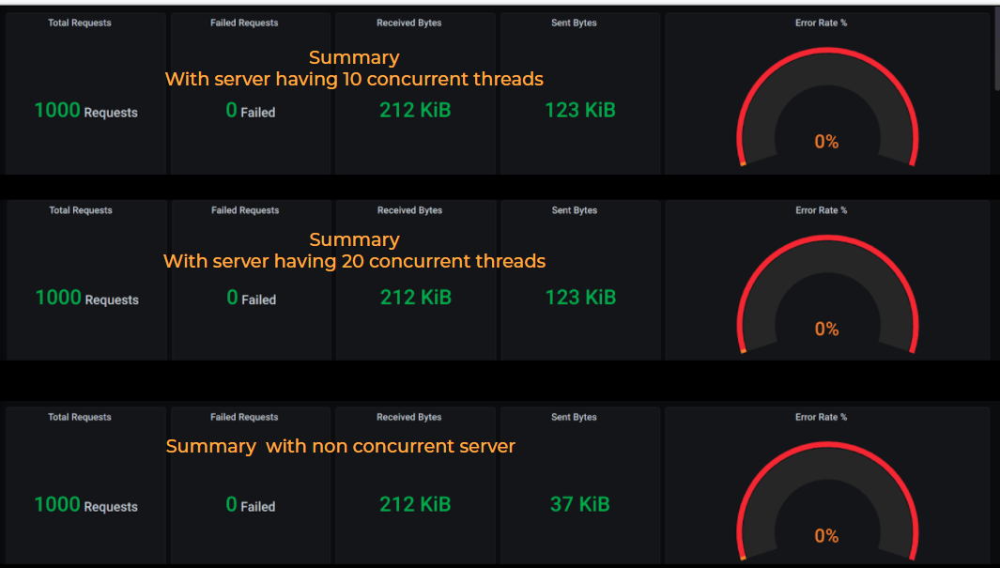

#### Number of active threads(users) at Jmeter during testing:

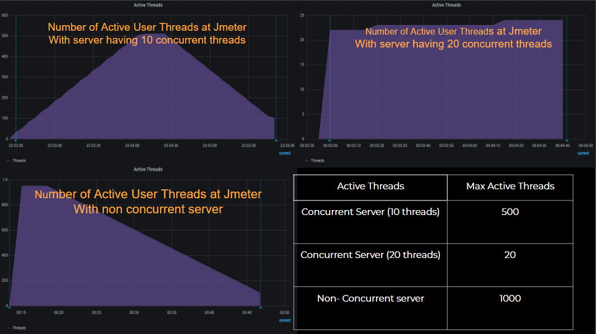

* In the case of non concurrent server, a number of requests gets queued since the server processes only one request at a given time. This leads to the number of active users being around 1000 at some point of time. After some time, the server starts processesing these pending requests and as the requests get cleared, the number of active users start to decrease as evident by a downward slope in the graph.

* In the case of concurrent server with a thread pool of size 10, jmeter sends 10 requests every second. Since each requests takes 2 seconds of time to be served, every second 10 requests get queued at the server. Thus, there is a steady increase in the number of active users, although the maximum number of users active during the testing is around 500. This is due to the fact mentioned above.

* In the case of concurrent server with a thread pool of size 20, every request sent by jmeter is accepted by the server and scheduled instantly. This is because every 2 seconds 20 threads can be scheduled for 20 incoming requests. Thus the active number of users during the testing, is constant around 20.

#### Response Time of the requests as measured by Jmeter:

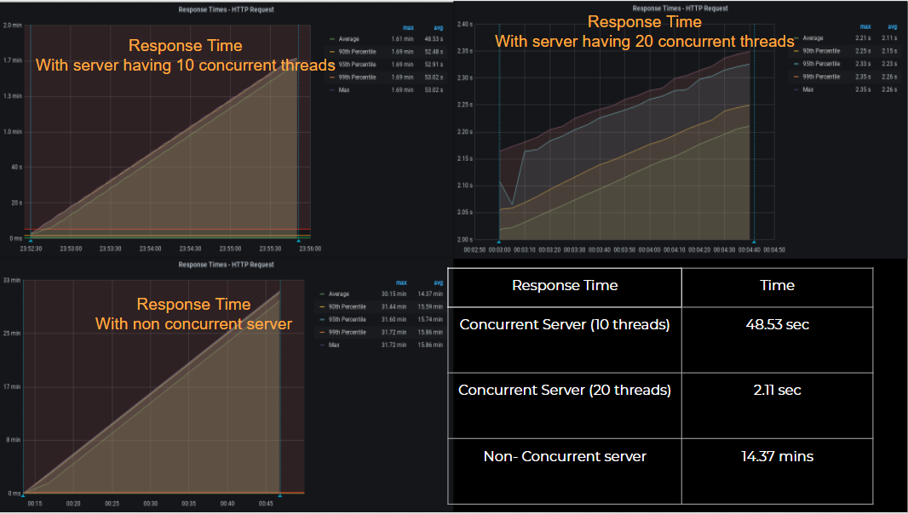

* In the case of non concurrent server, the response time for requests reach as high as 30.15 min with the average response time being 14.37 min. This is again because the non concurrent server only serves one request at a given time.

* In the case of concurrent server with a thread pool of size 10, the response time for requests reach as high as 1.61 min with the average response time being around 48.53 sec. The decrease in response time is due to the concurrent architecture of the server.

* In the case of concurrent server with a thread pool of size 20, the response time for requests reach around 2.21 sec with the average response time being around 2.11 sec. This configuration takes almost constant time to serve requests as it should ideally. Around 2 seconds are required since our request to the server is to spin for 2 seconds.

### Throughput of the server as measured by Jmeter:

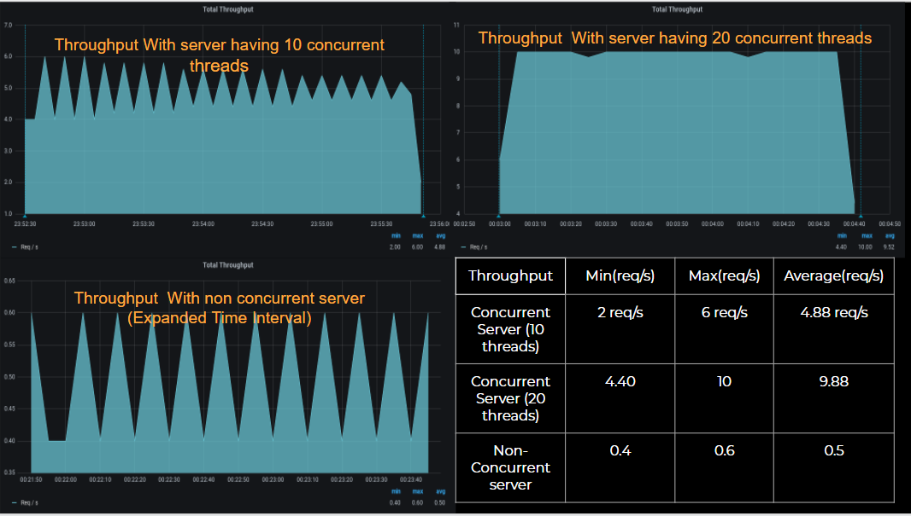

* In the case of non concurrent server, the throughput for requests reach only around 0.6 request/sec with the average throughput being 0.5 request/sec. This is again because the non concurrent server only serves one request at a given time.
The maximum throughput comes to be 0.6 request/sec since some time is required in connection setup and the downward slopes are due to the fact that the server requires 2 seconds time to serve this request and then schedule another.

* In the case of concurrent server with a thread pool of size 10, the throughput for requests reach as high as 6 request/sec with the average response time being around 4.88 request/sec. This configuration again has a saw-tooth graph since 10 requests are queued every 2 second while 10 are being served.

* In the case of concurrent server with a thread pool of size 20, the throughput for requests reach around 10 request/sec with the average response time being around 9.88 request/sec. This configuration has the maximum throughout of 10 as it should be ideally, since every request gets scheduled as soon as it arrives.